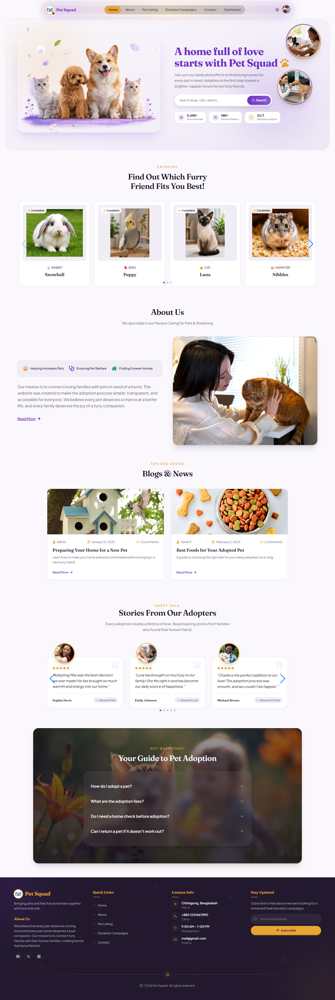
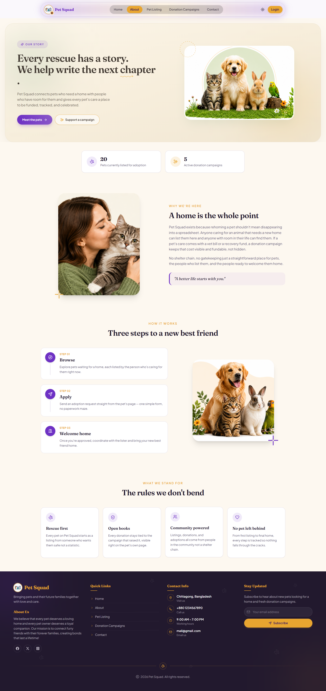
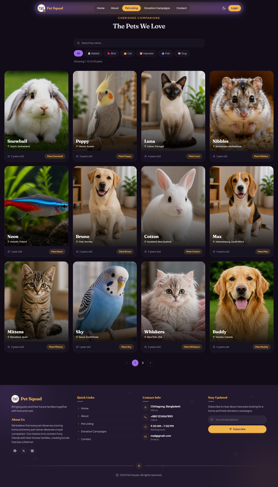
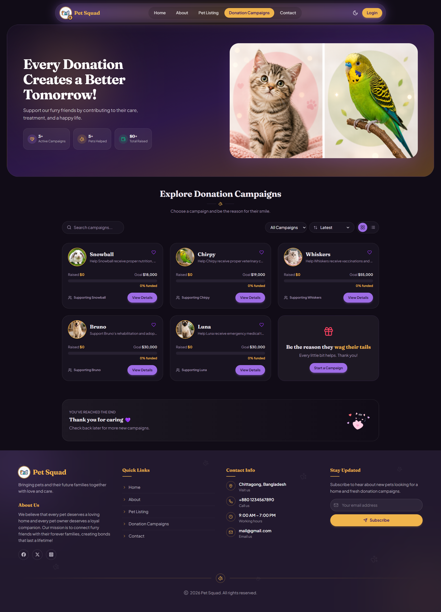
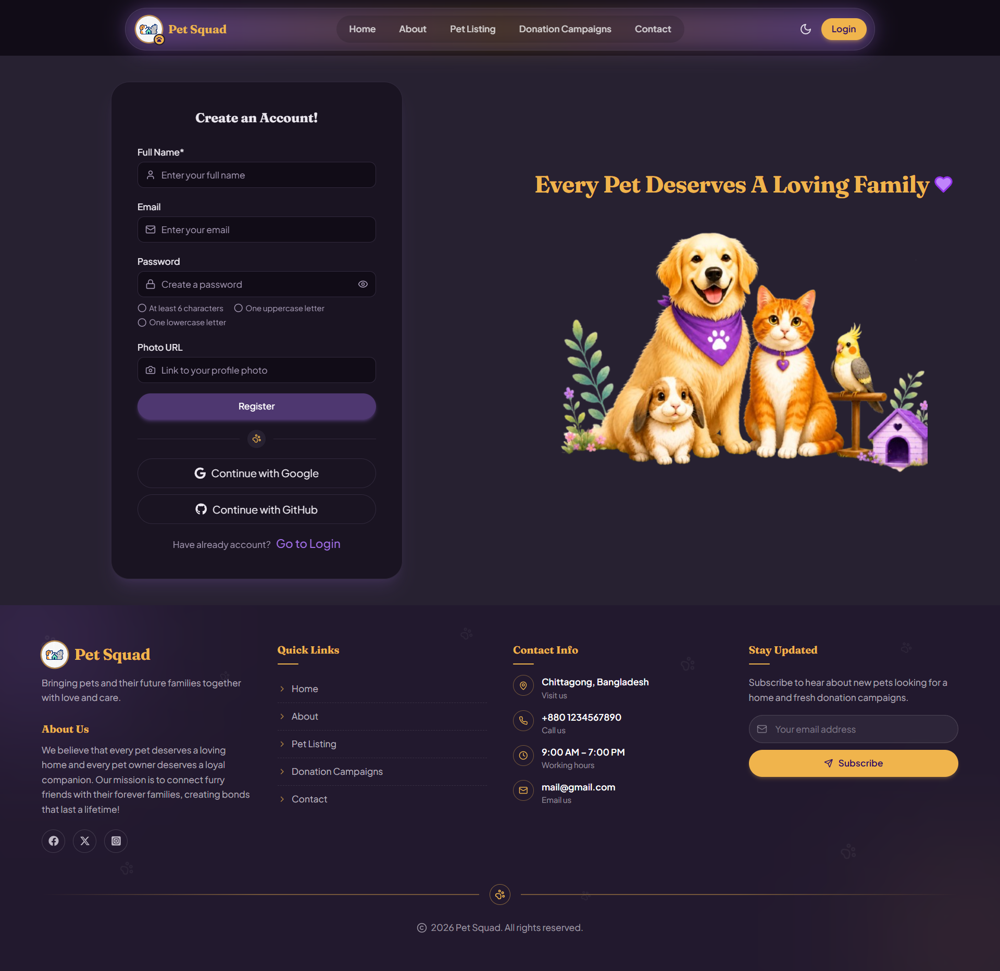
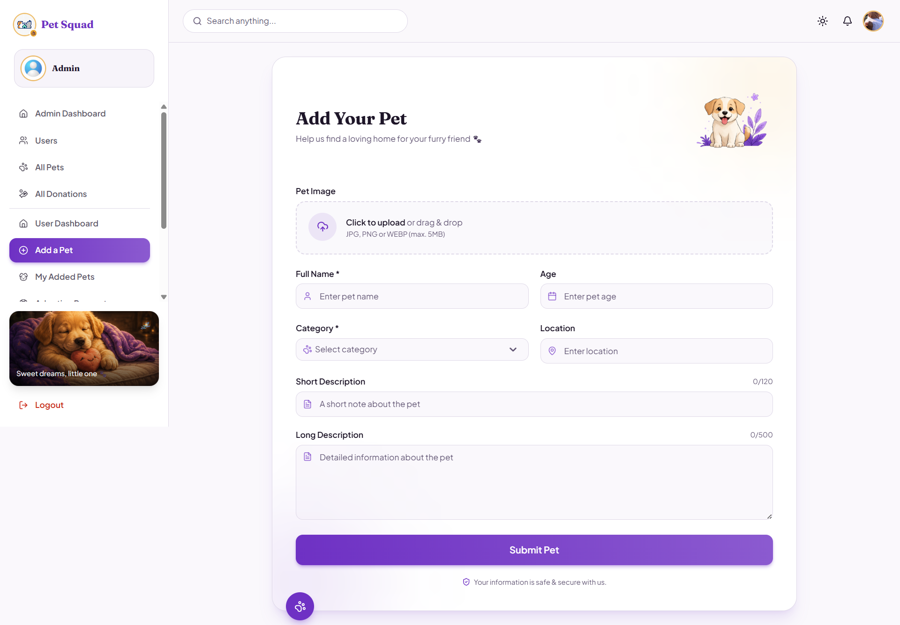
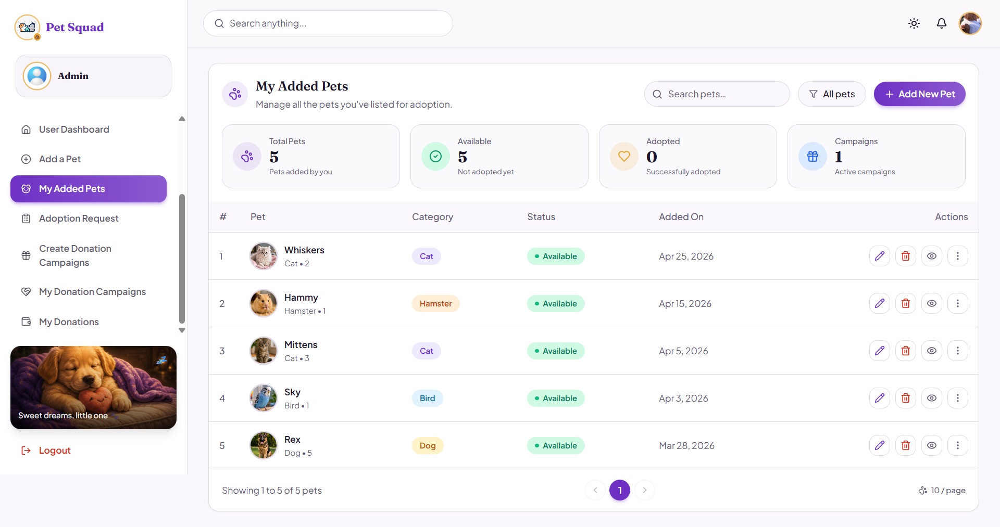
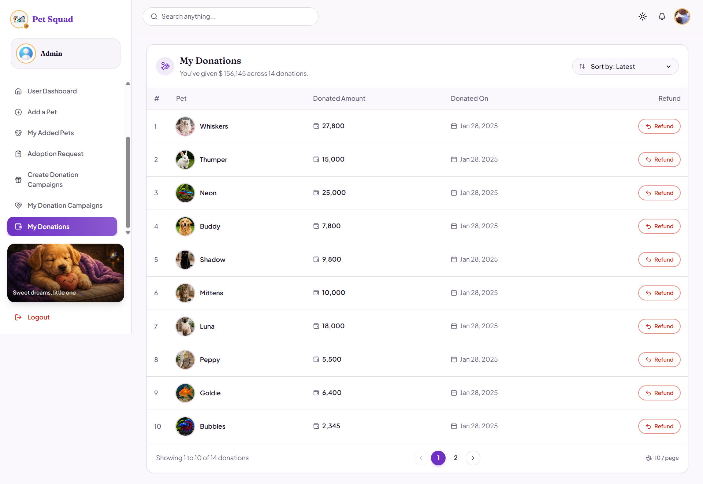
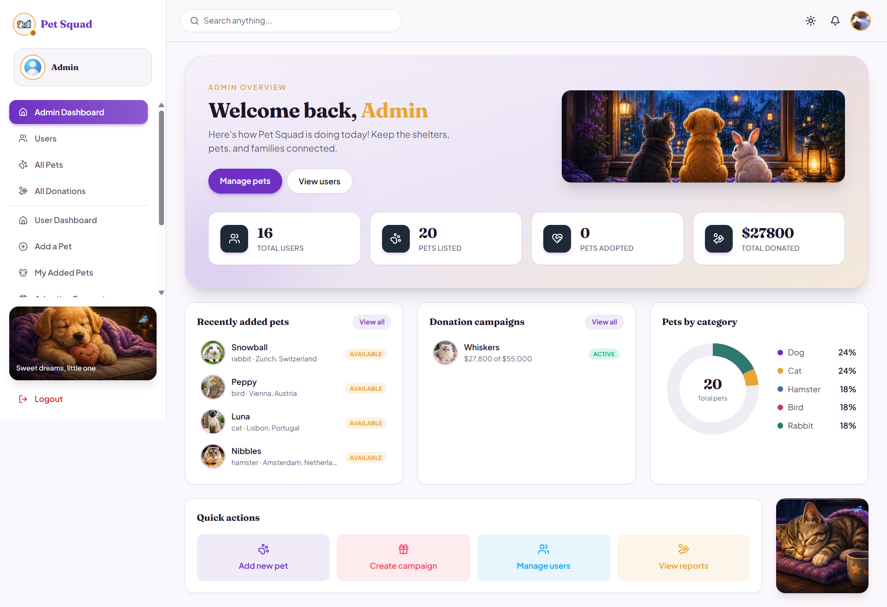

<div align="center">

# 🐾 Pet Squad

**Connecting loving homes with pets who need them.**

Browse adoptable pets, submit adoption requests, and fund pet-care donation campaigns — all in one modern, responsive platform.

[](https://pet-squad-3ea76.web.app)
[](https://github.com/noor00111/pet-squad-server)


</div>

---

## 📖 Purpose

Pet Squad connects pet seekers with adoptable animals, making the adoption process smooth and simple to use. Beyond adoption, it also lets the community fund pet-care donation campaigns with secure card payments, so pets in need can get medical care, food, and shelter while they wait for a home.

---

## 🔗 Quick Links

| Resource | Link |
|---|---|
| 🌐 Live Site | [pet-squad-3ea76.web.app](https://pet-squad-3ea76.web.app) |
| 🖥️ Server Repository | [pet-squad-server](https://github.com/noor00111/pet-squad-server) |

---

## 📸 Website Look

<div align="center">

### 🏠 Home Page


### ℹ️ About Page


### 🐶 Not Yet Adopted Pets


### 💝 Donation Campaign


<br/>

<table>
<tr>
<td align="center"><b>📝 Sign Up</b><br/></td>
<td align="center"><b>➕ Add a Pet</b><br/></td>
</tr>
<tr>
<td align="center"><b>🐾 My Added Pets</b><br/></td>
<td align="center"><b>💳 My Donations</b><br/></td>
</tr>
</table>

### 🛠️ Admin Dashboard


</div>

---

## ✨ Key Features

- 🐕 **Pet Listings** — Browse adoptable pets with detailed profiles, filters, and sorting.
- 🔍 **Search & Filters** — Find pets by category, age, and adoption status.
- 🔐 **User Authentication** — Secure login & registration using JWT and Firebase Authentication.
- 🗄️ **Database Management** — Uses MongoDB for pet, user, adoption, and donation data.
- ⚡ **Data Fetching** — Powered by TanStack Query (including infinite-scroll pagination) for optimized API interactions.
- 🎨 **Modern UI** — Built with ShadCN UI, Tailwind CSS, Framer Motion, and React.js for a sleek, responsive, animated design.
- 📋 **Adoption Requests** — Users can submit adoption requests, and pet owners can accept or decline them.
- 💰 **Donation Campaigns** — Create and browse pet-care donation campaigns, with live progress tracking and pause/resume controls for campaign owners.
- 💳 **Secure Payments** — Donate to any campaign via Stripe, with donation history and refund support.
- 🛠️ **Admin Panel** — Manage users, pets, and donation campaigns; promote users to admin.
- 📱 **Mobile-Friendly** — Fully responsive design for all devices.

---

## 🏗️ Backend Architecture

The server (`pet-squad-server`) is organized into layers so each concern lives in one place:

```
routes/        → maps HTTP paths to controllers per resource (users, pets, adoption, donation campaigns, donations, auth)
controllers/   → handles request/response and authorization checks
services/      → talks to MongoDB collections
middlewares/   → JWT verification, admin checks, and ownership checks
config/db.js   → MongoDB connection and shared helpers
```

---

## 📦 Tech Stack & Packages

<table>
<tr>
<td valign="top" width="50%">

**Core**
- react
- react-dom
- react-router-dom

**Authentication & Security**
- jsonwebtoken (JWT)
- firebase

**Database & Backend**
- nodejs
- MongoDB
- express
- cors
- dotenv

**Payments**
- stripe
- @stripe/react-stripe-js
- @stripe/stripe-js

</td>
<td valign="top" width="50%">

**Data Fetching & State Management**
- @tanstack/react-query
- @tanstack/react-table
- axios

**UI & Styling**
- tailwindcss
- @radix-ui + shadcn/ui components
- framer-motion (motion)
- lucide-react
- swiper

**Additional Utilities**
- react-hook-form
- formik
- sweetalert2
- react-toastify
- react-modal
- react-select
- react-helmet-async

</td>
</tr>
</table>

